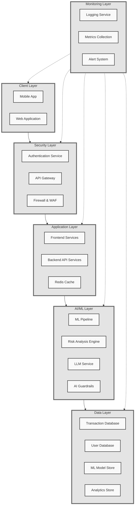
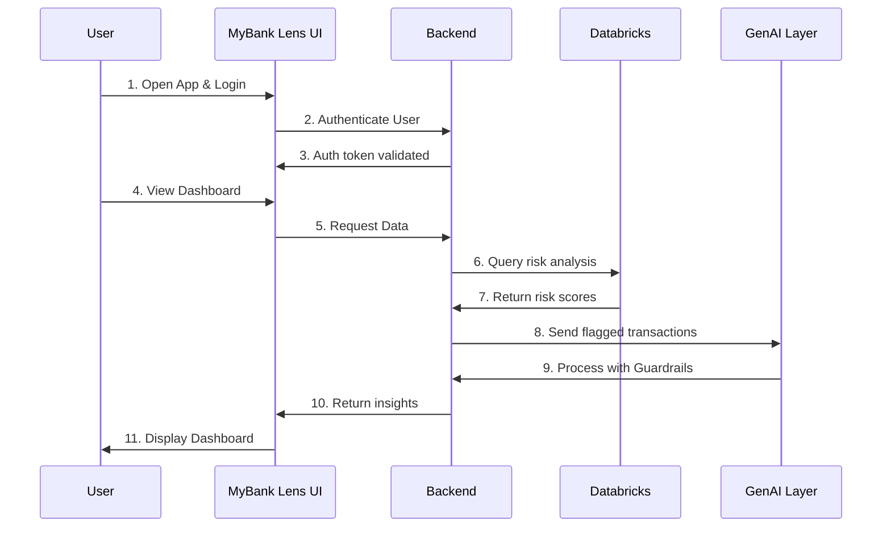

# MyBank Lens

**MyBank Lens** is a multi-perspective financial platform aimed at helping students manage their budgets, analyze spending habits, detect security threats, and receive AI-driven insights—transforming routine banking into a proactive, educational, and secure experience.

---

## 1. Overview

- **Multiple Perspectives**: 
  - **Budgeting & Spending**: Tracks daily/weekly/monthly expenses and provides category breakdowns.  
  - **Security & Threat Awareness**: Real-time anomaly detection, threat modeling (STRIDE/DREAD), and alerts.  
  - **Generative AI Guidance**: Personalized tips on budgeting, suspicious transactions, and environmental impact.

- **Hackathon-Friendly**: The project is structured to be feasible under tight deadlines (target: by Sunday 6 AM), with a clear separation of concerns between front end (Next.js) and back end (Node/Express or another simple server).

---

## 2. Key Features

1. **Multi-Angle Finance Dashboard**  
   - Daily/Weekly/Monthly summaries.  
   - Category-based spending charts.  
   - Optional environmental “green score” of purchases.

2. **Security Threat Detection**  
   - Anomaly/fraud detection (via a simple ML pipeline or Databricks).  
   - STRIDE/DREAD-based scoring for flagged transactions.  
   - Alerts & warnings (push notifications or dashboard notifications).

3. **Generative AI Assistant (with Guardrails)**  
   - Conversational interface that explains flagged transactions and offers spending tips.  
   - Guardrails to ensure RBC compliance, no sensitive data leaks, and factual advice.

4. **Educational Layer**  
   - Gamified lessons on phishing and safe e-transfers.  
   - Points/badges for completing security scenarios.

5. **Secure User Onboarding**  
   - RBC/Auth0-based login.  
   - Potential for multi-factor authentication (MFA).  
   - Suspicious login alerts.

---

## 3. System Architecture

Below is a **high-level system architecture** diagram in Mermaid. It shows the primary layers of the MyBank Lens application, from client interactions down to data and monitoring layers.



## 4. Sequence Diagram

Finally, this **sequence diagram** provides a time-ordered view of how each component interacts within a single use-case scenario (user logs in, sees flagged transactions, obtains AI-driven explanations).



---

## 6. Project Structure (High-Level)

For simplicity, this repository is divided into **two main folders**: one for the **Next.js frontend** and one for the **backend**. Below is an example structure:

```
mybank-lens/
│
├── README.md
├── .gitignore
├── .env                 # Top-level env for shared secrets (optional, or keep separate .env files)
│
├── frontend/            # Next.js project
│   ├── package.json
│   ├── next.config.js
│   ├── public/
│   ├── styles/
│   ├── components/
│   └── pages/
│       ├── _app.js
│       ├── index.js     # Login or landing
│       ├── dashboard.js # Main user dashboard
│       └── ...
│
└── backend/             # Node/Express server (or your preferred backend framework)
    ├── package.json
    ├── server.js        # Main entry point
    ├── routes/
    │   ├── authRoutes.js
    │   ├── transactionRoutes.js
    │   └── ...
    ├── controllers/
    │   ├── authController.js
    │   └── transactionController.js
    ├── services/
    │   ├── anomalyDetectionService.js
    │   └── aiService.js
    ├── config/
    │   └── db.js
    └── utils/
        └── dreadScoring.js
```

### Frontend (Next.js)

- **`pages/`**: Contains the main app pages (Login, Dashboard, etc.).
- **`components/`**: Reusable UI components (charts, cards, etc.).
- **`styles/`**: Global and component-specific CSS or SASS files.

### Backend (Node/Express)

- **`server.js`**: Initializes Express server, sets up middleware, starts listening.
- **`routes/`**: Defines endpoints for authentication, transactions, and other resources.
- **`controllers/`**: Business logic for each route (fetching data, error handling).
- **`services/`**: Houses logic that might interface with Databricks, LLMs, or ML services.
- **`config/`**: Configuration files for databases, environment variables, etc.
- **`utils/`**: Shared helper functions or scoring logic (e.g., STRIDE/DREAD scoring).

---

## 7. Setup & Installation

1. **Clone the repository**:
   ```bash
   git clone https://github.com/<your-org>/mybank-lens.git
   cd mybank-lens
   ```

2. **Set up environment variables**:
   - Create `.env` files in `frontend/` and `backend/` with relevant keys:
     - **Frontend** (`frontend/.env.local`):
       ```
       NEXT_PUBLIC_BACKEND_URL=http://localhost:4000
       ```
     - **Backend** (`backend/.env`):
       ```
       PORT=4000
       OPENAI_API_KEY=...       # For Generative AI
       RBC_CLIENT_ID=...        # If using RBC Auth
       RBC_CLIENT_SECRET=... 
       ```

3. **Install dependencies**:
   - Frontend:
     ```bash
     cd frontend
     npm install
     ```
   - Backend:
     ```bash
     cd ../backend
     npm install
     ```

4. **Run development servers**:
   - **Frontend** (Next.js):
     ```bash
     npm run dev
     ```
     Access at [http://localhost:3000](http://localhost:3000).

   - **Backend** (Node/Express):
     ```bash
     npm run dev
     ```
     Access the API at [http://localhost:4000](http://localhost:4000).

---

## 8. Usage

1. **Login**  
   - Navigate to [http://localhost:3000](http://localhost:3000).  
   - Click “Login” or “Sign in with RBC/Auth0” (depending on your mock setup).

2. **Dashboard**  
   - After successful login, you’ll see the budgeting charts, flagged transactions, and optional environmental insights.

3. **AI Explanations**  
   - If a transaction is flagged, click on “View Details” or an AI chat widget.  
   - The LLM (with guardrails) provides a short explanation of why the transaction is suspicious and suggestions for next steps.

---

### Thank You

We hope **MyBank Lens** showcases a comprehensive hackathon solution that merges **financial literacy**, **cybersecurity**, and **generative AI**—all under one flexible, user-centric platform. Good luck and have fun building!

---
